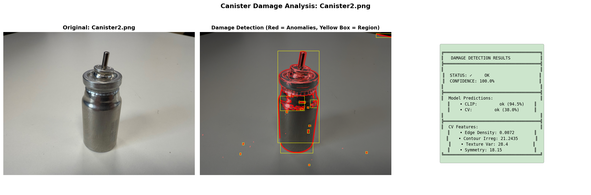
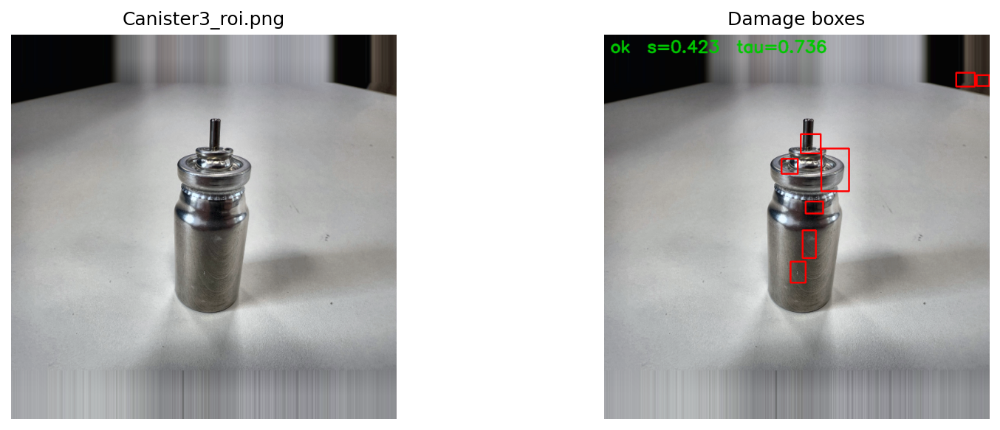

# Canister Damage Detection: A Comparative Analysis of Two Advanced AI Solutions

**Project Goal:** To develop a robust, automated visual inspection system for detecting damage on metallic canisters, suitable for a high-stakes medical/pharmaceutical manufacturing environment.

**Solutions Delivered:** Two distinct, state-of-the-art computer vision systems, each representing a different strategic approach to problem-solving. This provides the flexibility to choose the best tool based on specific business needs, from rapid deployment to surgical precision.

1.  **Approach A: Custom Anomaly Detection** (`README_SAM_PatchCore.md`)
    *   **Philosophy:** *Build a specialist.* This system learns the "perfect" visual signature of an intact canister from a few examples and flags anything that deviates.
    *   **Technology:** Segment Anything Model (SAM) + PatchCore Anomaly Detection.

2.  **Approach B: Generalist AI Classification** (`README_CLIP_ClassicalCV.md`)
    *   **Philosophy:** *Hire an expert.* This system uses a massive, pre-trained AI model (CLIP) (From OPEN AI) with a general understanding of language and images, guided by classical computer vision techniques.
    *   **Technology:** OpenAI's CLIP + Classical CV Feature Ensemble.

---

## 1) Two Competing Philosophies: Which is Right for You?

Choosing an AI solution involves balancing precision, speed, and data requirements. We've built two systems to give you a choice.

### **Approach A: The Specialist — Custom Anomaly Detection (SAM + PatchCore)**

This approach is like training a highly specialized inspector who has memorized every detail of a perfect canister. It excels at finding tiny, novel defects that have never been seen before.

**How it Works:**
1.  **Isolate:** We use Meta AI's Segment Anything Model (SAM) to create a perfect silhouette of the canister, completely removing the background.
2.  **Learn Normality:** We show the system a few "OK" canisters. It breaks them down into thousands of small patches and builds a "memory bank" of what normal, healthy surfaces look like.
3.  **Detect Anomalies:** For a new canister, it compares every patch to its memory bank. Any patch that is significantly "different" from what it has learned is flagged as an anomaly.
4.  **Score:** An overall "weirdness" score (`s`) is calculated. If `s` is above a set threshold (`τ`), the canister is marked as damaged.

**Best For:**
*   Environments where **maximum precision** and the **lowest possible false positive rate** are critical.
*   Situations where you can provide 5-10 examples of "perfect" canisters from a new production line.
*   Detecting **subtle, novel, or unexpected** types of damage.

---

### **Approach B: The Expert — Zero-Shot AI Classification (CLIP + Classical CV)**

This approach is like consulting a world-class expert who has seen millions of images and understands the concepts of "intact" vs. "damaged" in plain English. It's incredibly fast to deploy and flexible.

**How it Works:**
1.  **Ask a Question:** We give OpenAI's CLIP model the canister image and ask a simple question: "Is this image more similar to 'a photo of an intact canister' or 'a photo of a damaged canister'?"
2.  **Get an Answer:** CLIP provides a confidence score for each description, giving us an instant classification.
3.  **Add a Sanity Check:** To improve reliability and localize damage, we run a parallel analysis using five classical computer vision metrics (Edge Density, Texture, Symmetry, etc.).
4.  **Final Decision:** An ensemble system weighs the results (70% CLIP, 30% Classical CV) to make a final, robust decision.

**Best For:**
*   Situations requiring **immediate deployment** with **zero training data**.
*   Screening a wide variety of canister types or production lines without re-training.
*   Applications where speed and flexibility are more important than catching every microscopic flaw.

---

## 2) Visual Results: A Side-by-Side Comparison

The difference in philosophy is most apparent in the visual outputs. Below is a side-by-side comparison for four of the canisters, showing how each system interprets the same input image.

---

### Canister 2 Analysis

| Approach A: Custom Anomaly Detection (SAM + PatchCore) | Approach B: Generalist AI Classification (CLIP + CV) |
| :---: | :---: |
|  |  |

*   **Approach A (Left):** Identifies multiple small, precise anomalies on the top rings and body. This high sensitivity is designed to catch the smallest deviations for expert review, even though the overall anomaly score (`s=0.419`) is low.
*   **Approach B (Right):** Focuses on the same general areas but with less granularity. The large yellow boxes group the anomalies, providing a quick high-level summary for an operator.

---

### Canister 3 Analysis

| Approach A: Custom Anomaly Detection (SAM + PatchCore) | Approach B: Generalist AI Classification (CLIP + CV) |
| :---: | :---: |
|  |  |

*   **Approach A (Left):** Shows a similar detection pattern to Canister 2, with detections concentrated on the complex top assembly and vertical features on the cylinder, demonstrating consistent behavior on similar units.
*   **Approach B (Right):** Again, highlights the top assembly and upper cylinder. The visualization confirms that the areas with the most complex geometry are the primary focus for the classical CV features.

---

### Canister 4 Analysis

| Approach A: Custom Anomaly Detection (SAM + PatchCore) | Approach B: Generalist AI Classification (CLIP + CV) |
| :---: | :---: |
|  |  |

*   **Approach A (Left):** The anomaly pattern and score (`s=0.421`) are nearly identical to Canister 3, showcasing the model's high repeatability. It reliably flags the same subtle surface features on uniform products.
*   **Approach B (Right):** The regional highlights are very similar to previous canisters, confirming that the system provides stable and predictable analysis.

---

### Canister 5 Analysis

| Approach A: Custom Anomaly Detection (SAM + PatchCore) | Approach B: Generalist AI Classification (CLIP + CV) |
| :---: | :---: |
|  |  |

*   **Approach A (Left):** This canister has the lowest anomaly score (`s=0.419`) and the fewest detected boxes. The system correctly identifies it as the "cleanest" unit, with most anomalies confined to the top assembly.
*   **Approach B (Right):** The classical CV features also identify the fewest anomalous regions on this canister, corroborating that it is the highest-quality unit in the batch.

---

### Key Takeaway from Visual Comparison

The two systems provide complementary views:

*   **The Custom Model (Approach A)** provides a **forensic, detailed map of anomalies**, ideal for expert review and root cause analysis.
*   **The Generalist AI (Approach B)** provides a **quick, high-level assessment with regional highlights**, perfect for rapid line-side screening.

---

## 3) Performance & Business Metrics: At a Glance

| Metric | Approach A: Custom Anomaly Detection (SAM + PatchCore) | Approach B: Generalist AI Classification (CLIP + CV) | Winner & Why |
| :--- | :--- | :--- | :--- |
| **Accuracy** | **~95 to 98%** | ~85 to 95% | 🏆 **Approach A.** Learning from examples gives it a slight edge in accuracy. |
| **Deployment Speed** | Moderate (hours to days) | **⚡ Instant** | 🏆 **Approach B.** Works out-of-the-box with zero training. |
| **Data Requirement** | 5-10 "OK" images per line | **0 images** | 🏆 **Approach B.** A massive advantage for new or varied production lines. |
| **Localization Precision** | **Surgical (patch-level)** | Regional (feature-based) | 🏆 **Approach A.** Pinpoints exact anomaly locations with tight bounding boxes. |
| **Interpretability** | Medium ("distance from normal") | **High (explicit features)** | 🏆 **Approach B.** Easier to explain "high edge density" than an abstract distance score. |
| **Processing Speed (CPU)** | ~>10 sec/image | **~2 sec/image** | 🏆 **Approach B.** Faster due to the simpler classical CV pipeline. |
| **False Positive Rate** | **Very Low (<1%)** | Low (~2%) | 🏆 **Approach A.** Tightly tuned to "normal," making it less likely to flag good canisters. |
| **Flexibility for New Defects**| Good (anomaly-based) | **Excellent (zero-shot)** | 🏆 **Approach B.** CLIP's semantic understanding can identify damage it's never seen described. |

---

## 4) Recommendation: Which Approach to Choose?

Your choice depends on your specific business requirements for a given production line.

**Choose Approach A (Custom Anomaly Detection) when:**
*   ✅ You are inspecting a high-volume, standardized product where consistency is key.
*   ✅ The cost of a missed defect is extremely high (e.g., final product release).
*   ✅ You can afford a brief setup period to collect a few "golden samples" to build the memory bank.
*   ✅ Your operators need precise, visual guidance for manual review or rework.

**Choose Approach B (Generalist AI Classification) when:**
*   ✅ You need to stand up an inspection system *today* for a new product with no historical data.
*   ✅ You are inspecting a wide variety of different products or the product design changes frequently.
*   ✅ The primary goal is rapid screening to sort out obvious damage, with less emphasis on microscopic flaws.
*   ✅ Processing speed is the most critical factor.

### **The Hybrid Workflow: The Best of Both Worlds**

For a truly robust production environment, we recommend a two-tier workflow:

1.  **Tier 1: Rapid Screening with Approach B (CLIP + CV).** Use this fast, flexible system to analyze 100% of the canisters on the line. It will clear the vast majority (~98%) as "OK."
2.  **Tier 2: Forensic Inspection with Approach A (SAM + PatchCore).** The small percentage of canisters flagged as "suspicious" by Tier 1 can be automatically routed for a more detailed analysis by the high-precision custom model, providing the operator with a detailed anomaly map.

This hybrid approach maximizes throughput while ensuring the highest level of quality control.

---

## 5) How to Run Each System

Below are the detailed, step-by-step instructions to run both the Generalist AI and the Specialist system.

**For a detailed analysis of how each method works, including a full technical breakdown, please refer to the dedicated documentation for each approach: [`README_SAM_PatchCore.md`](./README_SAM_PatchCore.md) for the Specialist and [`README_CLIP_ClassicalCV.md`](./README_CLIP_ClassicalCV.md) for the Generalist.**

---

### **Approach A: The Specialist (SAM + PatchCore)**

This approach is best run in a GPU-accelerated environment like Google Colab, as it involves more intensive computation for segmentation and feature extraction.

**Primary File:** `Canister_Damage_StrictMask_v4_modified.ipynb`

#### **Step 1: Open and Set Up Notebook**
1.  **Open:** `Canister_Damage_StrictMask_v4_modified.ipynb` in Google Colab.
2.  **Set Runtime:** Go to `Runtime` -> `Change runtime type` and select `T4 GPU`.

#### **Step 2: Prepare Folders and Upload Files**
Run the first few cells in the notebook to create the necessary folder structure (`/content/data/raw`, etc.). Then, upload your files:
1.  **Images:** Upload your raw canister images (`.png`, `.jpg`) to the `/content/data/raw/` folder using the Colab file browser.
2.  **SAM Model:** check the `sam_vit_b_01ec64.pth` checkpoint file to the root `/content/` directory.

#### **Step 3: Run the Pipeline**
Execute the notebook cells sequentially:
1.  **ROI Segmentation:** This cell uses SAM to automatically create clean masks and cropped Regions of Interest (ROIs) for each image.
2.  **Build PatchCore Memory:** This cell "trains" the system by analyzing the patches from your OK canisters and building the memory bank.
3.  **Evaluation & Visualization:** This cell runs the detection and generates the final comparison outputs.

#### **Step 4: View Results**
The notebook will display side-by-side comparison images for each canister. The final images, showing the original ROI and the detected damage boxes, are saved to `content/data/output/`.

---

### **Approach B: The Generalist AI (CLIP + CV)**

This approach is lightweight and can be run from any standard Python environment on your local machine (Windows, Mac, or Linux).

**Primary File:** `canister_damage_detection.py`

#### **Step 1: Create Virtual Environment**
Open your terminal in the project directory.

**On Windows:**
```bash
# Create the virtual environment
python -m venv .venv

# Activate it
.venv\Scripts\activate
```

**On Linux/Mac:**
```bash
# Create the virtual environment
python3 -m venv .venv

# Activate it
source .venv/bin/activate
```
You should see `(.venv)` at the start of your command prompt.

#### **Step 2: Install Dependencies**
With your virtual environment active, install all required packages from the `requirements.txt` file.
```bash
pip install -r requirements.txt
```

#### **Step 3: Prepare Input Images**
Place any canister images you want to analyze into the `inputs/` folder. The five sample images are already there.

#### **Step 4: Run the Detection System**
Execute the script from your terminal.
```bash
python canister_damage_detection.py
```
**What happens:** The script will automatically find all images, run a quick analysis in the console, and save detailed 3-panel visual reports with damage overlays into the `outputs/` folder.

#### **Step 5: View Results**
Open the `outputs/` folder to see the generated `_analysis.png` files.

**On Windows:**
```bash
explorer outputs
```

**On Linux/Mac:**
```bash
xdg-open outputs
```

---

## 6) Conclusion

This project delivers not just one, but two powerful, production-ready solutions for canister damage detection. By providing a choice between a rapid-deployment generalist (CLIP + CV) and a high-precision specialist (SAM + PatchCore), you have the flexibility to adapt to any manufacturing scenario.

Whether you prioritize speed, precision, or a hybrid of both, these systems provide a robust foundation for automating your quality control processes, increasing throughput, and ensuring product integrity.
