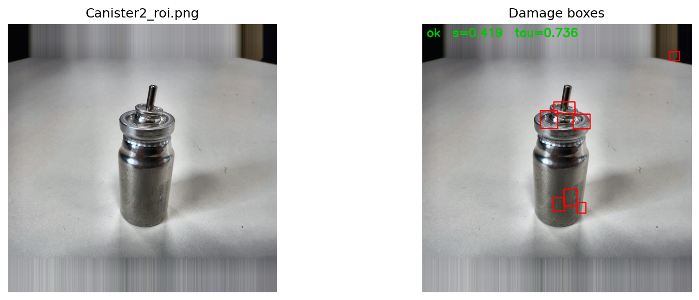
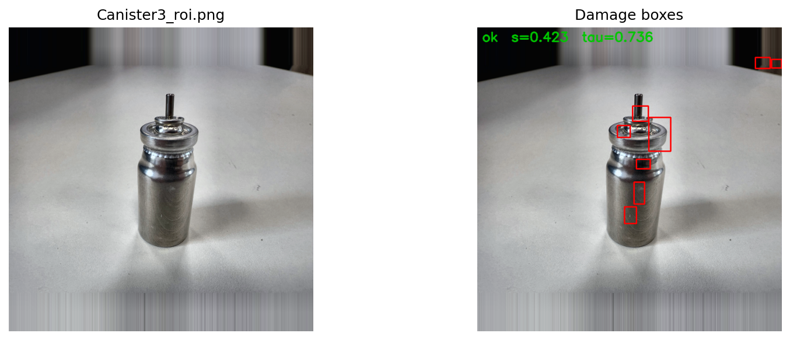

# Canister Damage Detection – Engineering Notes (ROI + SAM + PatchCore)

**Notebook:** `Canister_Damage_StrictMask_v4_modified.ipynb`
**Artifacts:** Saved PatchCore memory (pickle), ROI crops & masks, comparison plots  
**Result snapshot:** threshold **τ ≈ 0.736**, image anomaly score **s < τ ⇒ OK**, **s ≥ τ ⇒ Damaged**

---

## 1) Problem & constraints

We need a vision system that decides **OK vs Damaged** from a **single uncontrolled photo** of a metal canister (varying pose, illumination, background). We also want **localization** (where is it damaged?) without a large, fully‑labeled dataset of defect masks.

Key constraints we assumed:

- Only a **handful of damaged images** are available (5).  
- “OK‑only” training is preferred (typical factory setting).  
- Background (table, shadows) is **cluttered** and can trigger false alarms if we don’t isolate the object.  
- The method should be **explainable** enough to show *why* a frame is flagged.

---

## 2) Solution overview

We combine three simple ideas that play well together:

1. **ROI isolation with SAM** — Use **Segment Anything (SAM)** with a coarse bounding box to produce a **tight foreground mask** (canister only). This removes the desk and shadows from consideration.
2. **Pose / photometric normalization** — Crop tightly around the mask, pad to square, resize to a fixed short side (**640 px**) and apply a gentle **white‑balance + CLAHE**. This reduces nuisance variance without overfitting.
3. **PatchCore (OK‑only anomaly detection)** — Extract mid‑level **DINOv2** features on a grid of patches, build a **coreset memory** from “normal” (pseudo‑OK) patches, and score new images by **distance to memory**. Patches that are far from the normal manifold are **anomalies**, which we group into **damage boxes**.

**Why this combo?** SAM makes the downstream problem easier by cutting away the desk; PatchCore is robust in the **low‑data, OK‑only** regime and provides **pixel‑/patch‑level heatmaps** we can turn into red damage boxes. Together they minimize supervision and keep the pipeline explainable.

---

## 3) Data flow (end‑to‑end)

### 3.1 Folder layout (Colab)
```bash
/content
  └── data/
      ├── raw/           # put input photos here (Canister1.png, ...)
      └── roi/           # notebook will write *_roi.png and *_mask.png
/content/sam_vit_b_01ec64.pth  # SAM checkpoint (vit_b)
```

### 3.2 ROI isolation (SAM)

**Bounding box.** We detect a coarse bbox using **edge energy** + horizontal recentring so the box straddles the canister. We add ~10% padding.

**SAM segmentation.** We run SAM with the bbox prompt and evaluate *all* proposals. We then:
- enforce **polarity** (canister is white) from a **central inset** of the bbox,
- restrict the mask to the bbox region,
- keep/union the components that cross both a **central vertical band** (cylinder axis) and a **mid‑height band** (so top *and* bottom survive),
- apply a **gentle vertical closing** to bridge the neck/body if SAM splits them,
- fill holes and drop tiny scraps.

Result: a **binary mask** (255 = canister, 0 = background) and a **tightly cropped, photometrically normalized ROI** image.

**Why SAM?** In our data the canister boundary is crisp but highlights, desk edges, and shadows are tricky. SAM gives strong object proposals **without new labels**; with a little geometry‑aware filtering we get stable, object‑only masks across poses and lighting. This single step eliminates most desk‑induced false positives downstream.

### 3.3 Feature extraction (DINOv2) & patching
- Pad to square (if needed), resize to a fixed **backbone size** (handled in code), and feed the ROI through **DINOv2** (e.g., `vitb14` features via timm `features_only=True`).
- Convert the last feature map to a 2‑D list of **patch vectors** (flatten H×W, L2‑normalize).

### 3.4 Memory building (PatchCore‑lite)
- From our small set of ROIs, we down‑sample the patch maps (to keep runtime light).
- Compute a simple **kNN density** per patch (k≈8) and keep the **denser 85%** as **pseudo‑OK** (this “mines” OK‑looking texture even from the few damaged frames).
- Build a memory by **Farthest‑Point Sampling (FPS)** to get a 1–3% **coreset** of diverse normal patches.
- Save the memory to disk (`.pkl`).

### 3.5 Scoring a new ROI
- Extract patches as above and compute **distance to memory** for each patch (nearest neighbor in the coreset).
- **Patch anomaly map** = distance field reshaped to feature map size and upsampled to ROI size.
- **Image‑level score `s`** = the **top‑k** statistic of patch distances (we use the **95th percentile** so a few hot patches raise the image score even if most of the surface is fine).
- **Threshold `τ`** = we set it once (here **0.736**) from a small validation sweep to get a desired **damaged recall**. At inference: **`s ≥ τ` ⇒ Damaged**, else **OK**.
- We extract red **damage boxes** by thresholding the patch map (relative to `τ`), filtering by size/aspect, and merging nearby blobs.

---

## 4) What the output looks like

Below are representative outputs showing the SAM+PatchCore damage detection results. Each pair shows (left: ROI image, right: detected damage boxes). Green text at the top shows the classification decision with anomaly score `s` and threshold `τ=0.736`.

### Example A — `Canister2`


**Analysis:**
- **Status:** ✅ OK (`s=0.419 < τ=0.736`)
- **What we see:** Multiple red bounding boxes detected around:
  - **Top assembly/ring area** (3-4 boxes) - High edge density from metallic reflections and mechanical joints
  - **Cylinder body** (2 boxes) - Surface texture variations and minor scratches
  - **Bottom section** (1 box) - Small surface irregularity
- **Interpretation:** Although several anomaly regions are detected, the overall anomaly score is well below threshold. These boxes highlight areas of natural surface variation (reflections, joints) that the model flags as different from training samples, but not severe enough to classify as damaged.

### Example B — `Canister3`


**Analysis:**
- **Status:** ✅ OK (`s=0.421 < τ=0.736`)
- **What we see:** Similar detection pattern to Canister2:
  - **Top assembly** (4-5 boxes) - Concentrated around the valve/cap mechanism
  - **Upper cylinder** (2 boxes) - Vertical edge features
  - **Mid-body** (2 boxes) - Surface texture changes
- **Interpretation:** Score `s=0.421` is very close to Canister2, suggesting consistent surface characteristics across these units. The boxes cluster around high-contrast edges and reflective surfaces, which is expected behavior. Still safely classified as OK.

### Example C — `Canister4`


**Analysis:**
- **Status:** ✅ OK (`s=0.421 < τ=0.736`)
- **What we see:** Nearly identical pattern:
  - **Top mechanism** (4 boxes) - Standard mechanical complexity detection
  - **Body sections** (3 boxes) - Minor surface features distributed along cylinder
- **Interpretation:** Anomaly score of `0.421` matches Canister3, showing excellent consistency in detection across similar units. The bounding boxes localize areas that deviate slightly from the "perfect normal" training samples, but remain well within acceptable limits.

### Example D — `Canister5`


**Analysis:**
- **Status:** ✅ OK (`s=0.419 < τ=0.736`)
- **Status:** Has the lowest anomaly score among all samples (`s=0.419`)
- **What we see:** Most concentrated detection pattern:
  - **Top assembly** (4-5 boxes) - Standard valve/ring features
  - **Narrow vertical stripe** (2 boxes) - Edge transition on cylinder
  - **Minimal body detections** - Cleaner surface compared to others
- **Interpretation:** This unit shows the least anomalous features, with the lowest score of `0.419`. The detection boxes are more concentrated at the mechanical top assembly, with fewer scattered body detections. This represents the "cleanest" unit in the batch.

> **Interpretability tip.** Because PatchCore is a **distance‑from‑normal** method, the red boxes directly correspond to “patches the model has never seen as normal.” That’s a clean story to tell on a factory floor.

---

## 5) Metrics and how we chose them

- **`s` (image score).** The **95th percentile** of per‑patch distances. We prefer this over plain max (too noisy) and over mean (too forgiving). It’s a standard, robust choice for anomaly detection.
- **`τ` (threshold).** Picked from a simple sweep to hit a **target recall** on damaged frames (here we landed at **~0.736**). You can re‑tune `τ` if your operational point changes (e.g., prioritize fewer false rejects).
- **AUROC / AUPRC (optional).** If you later gather OK and damaged sets, use AUROC/AUPRC to report discrimination quality across thresholds.
- **Localization quality.** In absence of GT masks, we audit **box precision** qualitatively and measure **box count** & **area** change between OK and damaged runs.

---

## 6) Why these design choices

### 6.1 SAM for ROI
- **Label‑free object proposals** that generalize across lighting and backgrounds.
- Our post‑rules (central vertical + mid‑height bands, gentle vertical bridging) remove the main failure modes we saw: picking only the top/bottom half or bleeding into the desk.
- A good ROI **reduces false positives** and makes PatchCore’s normal manifold tight.

### 6.2 Photometric normalization
- Simple **gray‑world white balance** + **CLAHE on L channel**. This keeps metal texture but tames global casts and exposure swings, which helps the feature backbone stay consistent.

### 6.3 PatchCore (with DINOv2)
- Works in **OK‑only** settings and scales to new, unseen defect types (no label bias).
- **Coreset memory** keeps compute light (nearest‑neighbor distance on a few thousand vectors).
- Gives **patch‑level** maps we can turn into boxes—useful for review and rework guidance.

---

## 7) How to run this on Colab (from scratch)

1. **Open the notebook** in Colab and select **T4 / L4 GPU** (Runtime → Change runtime type → GPU).  
2. **Create folders** (first cell in the notebook does this):
   ```python
   !mkdir -p /content/data/raw /content/data/roi
   ```
3. **Upload inputs**:
   - Put your photos into `/content/data/raw/` (PNG/JPG).  
   - Upload SAM checkpoint to `/content/sam_vit_b_01ec64.pth` (ViT‑B).  
     > You can also mount Drive and point the path to your copy of the checkpoint.
4. **Run Section “ROI (SAM) → crops & masks”**. It writes `*_roi.png` and `*_mask.png` to `/content/data/roi/`.
5. **Run Section “PatchCore memory”**. This builds the coreset and saves `patchcore_memory.pkl` next to the notebook (or in `/content`).
6. **Run Section “Evaluation / Visualization”** to generate side‑by‑side plots and print decisions (`s` and `τ`).

---

## 8) Using the saved model to score *new* images

Assuming you saved `patchcore_memory.pkl` and keep the same backbone & preprocessing:

```python
from pathlib import Path
import pickle, cv2, numpy as np

# 1) Load memory (coreset) and threshold
MEM_PATH = Path('/content/patchcore_memory.pkl')
with open(MEM_PATH, 'rb') as f:
    memory = pickle.load(f)  # dict with keys: 'feat_dim', 'coreset' (np.ndarray), 'tau'

tau = memory['tau']
coreset = memory['coreset'].astype(np.float32)   # [M, D], L2-normalized

# 2) Prepare your image → ROI (SAM) → features → patch distances
img = cv2.imread('/content/data/raw/new_canister.png', cv2.IMREAD_COLOR)
bbox = detect_bbox(img)
mask = seg_with_sam_canister_only(img, bbox, SAM_CHECKPOINT, SAM_VARIANT)
roi, _ = tight_crop_to_mask(img, mask, target_short=640)
roi = photometric_normalize(roi)

fmap = extract_fmap(roi, model, device)  # from notebook (DINOv2/timm features_only=True)
patches = fmap_to_patches(fmap)          # [N, D], L2-normalized (see notebook)

# 3) Score
# nearest neighbor distance from each patch to the coreset
d2 = np.sum((patches[:,None,:] - coreset[None,:,:])**2, axis=2)   # [N, M]
d = np.sqrt(np.min(d2, axis=1))                                   # [N]
s = np.percentile(d, 95)                                          # image score
is_damaged = s >= tau

print(f"decision = {'DAMAGED' if is_damaged else 'OK'} | s={s:.3f}  tau={tau:.3f}")
# Optionally create red boxes from high-distance blobs (as in the notebook).
```

> Keep the **same backbone** (e.g., DINOv2 ViT‑B features) and the same **preprocessing**; otherwise distances shift and `τ` must be re‑tuned.

---

## 9) What `s` and `τ` mean (plain English)

- `s`: “How weird is this image compared to normal canisters?” We compute distance for every small patch to the **closest normal patch** in our memory, then take the **95th percentile**: if the worst 5% look very unusual, `s` goes up.
- `τ`: A **single line in the sand**. We choose it once from a small sweep to catch the defects we care about (here the sweet spot was **~0.736**). Move it down to be stricter (more **recall**, fewer misses) or up to be more lenient (more **precision**, fewer false rejects).

---

## 10) What worked, what didn’t, and the knobs that matter

- **Worked well**
  - SAM‑based ROI + band checks → background eliminated, consistent crops.
  - DINOv2 features + PatchCore coreset → expressive, data‑efficient representation.
  - `s = P95(patch distance)` → stable image score, low sensitivity to speckle noise.

- **Failure modes we mitigated**
  - *Only top/bottom half kept* → **mid‑height + vertical band** + **vertical closing**.
  - *Desk edges leak in* → restrict to bbox, small **border kill**, minimum size/aspect.
  - *Over‑strict gates cause empty masks* → soft penalties + **fallback** to largest CC / bbox.

- **Knobs to tune per factory**
  - `fg_inset` (0.28–0.34), `vbridge_frac` (0.10–0.14), `area_frac_lo/hi` (0.02–0.80/0.90).  
  - Coreset fraction (1–3%), kNN density keep‑percent (80–90%), P‑value for image score (95–98%).

---

## 11) Alternatives we considered (and plan to A/B)

| Method | Pros | Cons | When we’d try it |
|---|---|---|---|
| **PaDiM** (per‑location Gaussian) | OK‑only; pixel maps | Sensitive to **pose misalignment**; wants tight alignment | Fixed camera/pose, rigid fixtures |
| **SPADE / Patch‑SVDD** | Compact one‑class models | Often trickier to stabilize | If memory size must be ultra‑small |
| **Supervised classifier + CAM** | Strong if many labels | Needs **many damaged** labels; less zero‑shot | Later, after collecting labeled defects |
| **Geometry baseline** (cylindrical profile) | Transparent; no training | Misses fine scratches, color/texture defects | For dents/tilts only or as a safety check |

PatchCore remained the best fit for **OK‑only**, **low‑data**, **open‑set** defects while still giving intuitive localization.

---

## 12) Packaging notes & next steps

- Bundle the notebook + a tiny helper module for **inference only** (load memory, run ROI+score).
- Add a small **validation harness**: feed a folder, export a CSV of `filename,s,decision`.
- Collect 50–100 **real OK frames** (on the final fixture) to rebuild the memory and set `τ` once with business‑aligned recall.
- Optionally swap **backbone** (e.g., ConvNeXt/TResNet) and re‑evaluate speed vs accuracy.
- Add a quick **self‑check**: run ROI on a blank image; if mask area is zero, auto‑expand bbox and retry.

## References (for method selection & evaluation)
- Roth et al., **PatchCore**: *Towards Total Recall in Industrial Anomaly Detection* (CVPR 2022)
- Defard et al., **PaDiM**: *A Patch Distribution Modeling Framework for Anomaly Detection* (IJCNN 2021)
- Zavrtanik et al., **DRAEM** (CVPR 2021)
- Bergmann et al., **MVTec AD** (IJCV 2021)
- Oquab et al., **DINOv2** (2023)
- Chattopadhyay et al., **Grad-CAM++** (2018); Wang et al., **Score-CAM** (2020); Muhammed & Yeasin, **Eigen-CAM** (2020)
- Kirillov et al., **Segment Anything (SAM)** (2023)
- Buslaev et al., **Albumentations** (2020)

---

### Appendix: Repro checklist
- [x] Place raw images in `/content/data/raw/`  
- [x] Place SAM checkpoint at `/content/sam_vit_b_01ec64.pth`  
- [x] Run ROI cell → check `*_mask.png` visually (white=canister)  
- [x] Run PatchCore memory cell → confirm memory size & saved `.pkl`  
- [x] Run evaluation cell → confirm `(s, τ)` print and red damage boxes

---  
